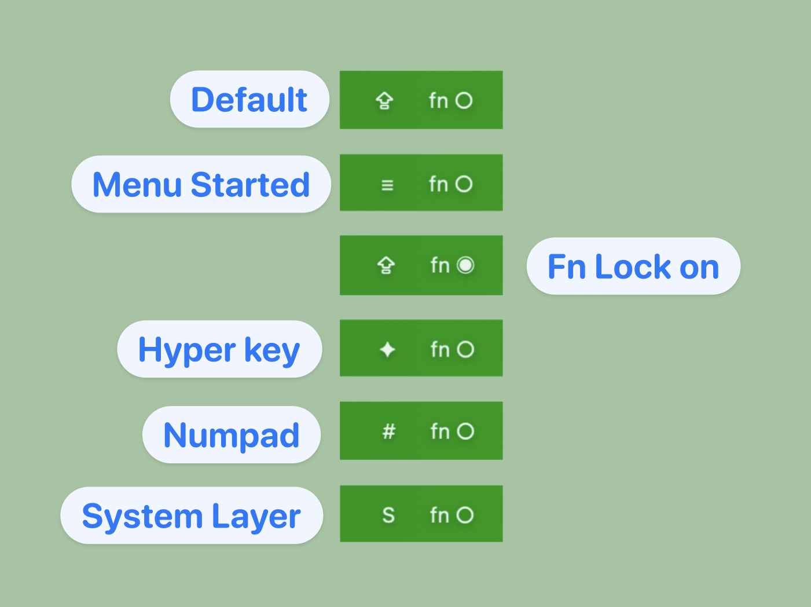

# @guiltyvictim's Karabiner Elements JSON config

[changelog](CHANGELOG.md)
## Introduction
This config was inspired by [@mxstbr's Karabiner Elements configuration](https://github.com/mxstbr/karabiner?tab=readme-ov-file), which I in turn discovered because of Raycast's video talking about his workflow.

Layering your shortcuts behind context is a great solution to the limited keys available, as well as making shortcuts more memorable. What I didn't like about his config however is having to play finger twisters by holding two keys down before the third that triggers the shortcut. It also disincentivises final key being on the same hand.

After exploring Karabiner Elements' docs I realised I could use a variable to store the current stat, allowing me the freedom to move my fingers onto the next key. It also allows me to use shortcuts when I'm lying in bed holding my laptop with one hand and doing shortcuts on the other.

I think this is also how people who use [stripped down custom keyboards](https://peterxjang.com/blog/designing-a-36-key-custom-keyboard-layout.html) use their keyboards, but I'm not braved enough to experiment with that so I can't attest to how accurate this is.
## Requirements
- [Karabiner Elements](https://karabiner-elements.pqrs.org/)
#### Optional:
- [Raycast](https://www.raycast.com/)
- [xbar](https://xbarapp.com/)
## What it does
This template allows you to use the Capslock key (⇪) to initiate layered shortcuts using Karabiner Elements
1. You start by hitting Capslock (⇪) and releasing it to trigger the 'menu' key
2. Next hit the relevant layer key
3. Finally hit the shortcut key for that layer
For example, to open Discord, I'd use (⇪, O, D) (note: comma denotes key is pressed and released)

In addition:
- The ⇪ key functions as a 'hyper' key when held down, invoking the ⇧^⌥⌘ keys at the same time
- I've added a Numpad layer with (⇪, N)
	- If at any point you wish to exit the numpad layer, you just have to hit Capslock (⇪) again.
- If you wish to toggle caps lock function itself, just use Shift (⇧) + Capslock (⇪)
- (⇪, S, F) toggles fn lock

All the layers are grouped into their own rules, so you can more easily edit the rules within Karabiner Elements if you want. However you must enable the 'Hyper and Menu Key' rule for everything else to work.
## Installation
1. Install and start [Karabiner Elements](https://karabiner-elements.pqrs.org/)!
2. Clone this repository
3. Copy and paste the `karabiner.json` file into your `~/.config/karabiner` folder
Note: Backup your own `karabiner.json` file first if you've made changes!
## Customising
Unlike mxstbr I'm not smart enough to build a typescript translator, so this is pure JSON. I've not looked at [Goku](https://github.com/yqrashawn/GokuRakuJoudo) yet as I'm just getting started with my experiment (started this afternoon!). I guess I'll replace this with a goku template once I've had a play.

I've left a template rule with this config, you just need to copy it and make changes to where it says `change_me` or "Change me".

The default action is Raycast's confetti to demo your keys working, change it to your desired action.
#### Logic
Each layer is separated into their own rules for ease of management, but they all start by a condition checking the `stat` variable to see if it's in **hyper** stat, if so capture the `key_code` (and optional modifiers if you want to go further), before updating `stat` to the current layer.

After that are all actions checking for the current layer's stat before resetting `stat` to **ready** and executing the shell_command, and we're ready to capture the hyperkey again!
#### Numpad config
In cases where you actually want to continue using the keys, such as numpad - just don't reset `stat` before the shell_command and we stay in the currently layer until ⇪ is pressed again.

I will add WASD as arrow keys and HJKL as VIM navigation to my config going forward, but you may also do things like volume and brightness controls without resetting immediately.
## xbar integration
In all the `shell_command`s you'll see that I chain an `echo` command to `stat.txt` and `fn_lock.txt` files.

e.g.:
```json
"shell_command": "open raycast://extensions/raycast/raycast/confetti; echo \"!ready\" > ~/.config/karabiner/stat.txt"
```

This is a helper file to be used along side [xbar](https://xbarapp.com/). I write in the current stat and display it on my menu bar by reading the text file's contents. This way I have eye on what my current stat is if I ever lose track.

I have a couple of very basic shell scripts in the xbar plugins folder `~/Library/Application Support/xbar/plugins/` that reads the files:
### stat.1s.sh:
```bash
#!/usr/bin/env bash
cat ~/.config/karabiner/stat.txt
```
### fn.1s.sh:
```bash
#!/usr/bin/env bash
cat ~/.config/karabiner/fn_lock.txt
```

The `.1s` part of the filename denotes how often the plugin is refreshed

Note: 1 second is the lowest limit, which means it's the fastest refresh rate possible.

xbar demo:

#### xbar not working?
Check that the files have the right `chmod` permissions:
- `a+rw` for the `.txt` files in `~/.config/karabiner/` folder
	- Write shouldn't be an issue as the file will be created by Karabiner Elements when you first use this template
	- Read also shouldn't be a problem if you're the same user, but I don't fully understanding file permissions in UNIX!
- `a+x` for the `.sh` files in the `~/Library/Application Support/xbar/plugins/` folder

Also I assume that the `#!/usr/bin/env bash` shebang works on all MacOS computers. I don't know UNIX so I can't troubleshoot if that could be an issue.